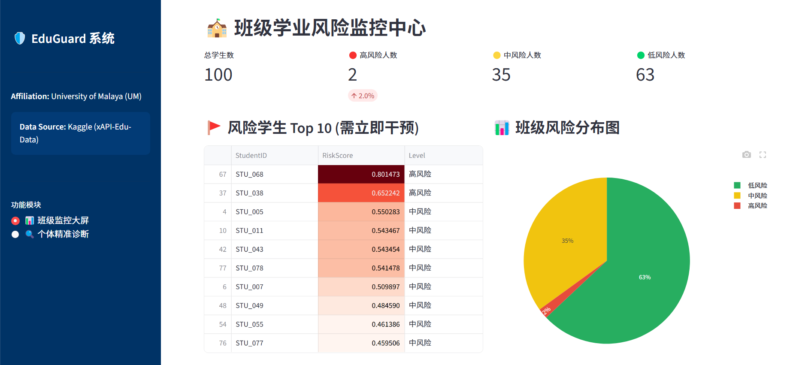
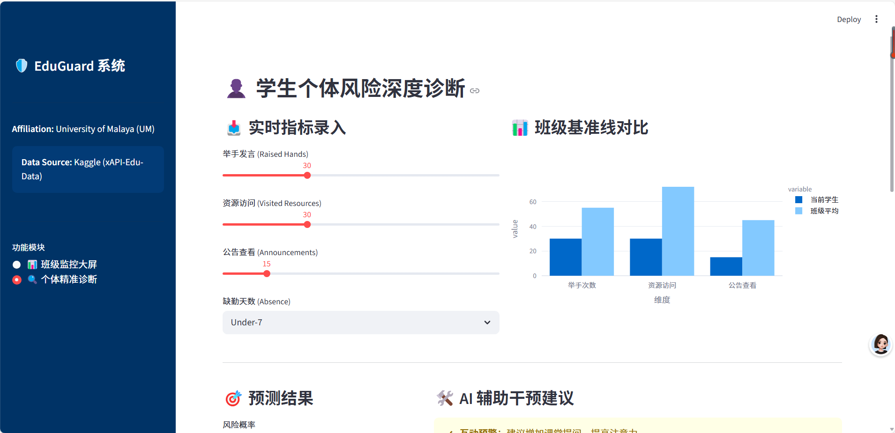
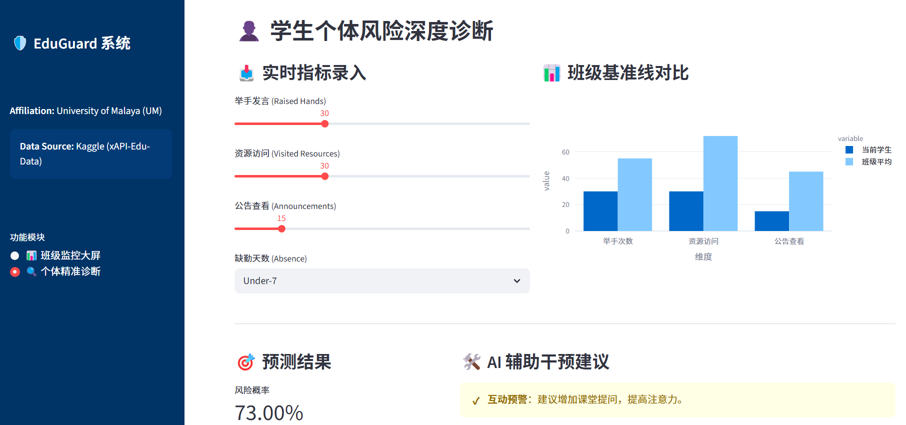
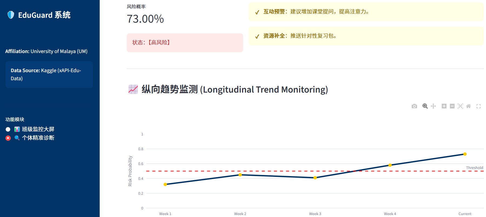

# 🛡️ EduGuard Pro: Academic Risk Early-Warning System
**An Intelligent Learning Analytics Dashboard for Proactive Intervention**

---

### 🏫 Affiliation
**University of Malaya (UM)** *Faculty of Computer Science and Information Technology / Faculty of Education*

### 📊 Data Source
**Kaggle: xAPI-Edu-Data** *Educational Data Mining (EDM) Dataset*

---

## 📖 Project Overview
EduGuard Pro is a sophisticated decision-support tool designed for educators and school administrators. By leveraging **Machine Learning (Random Forest)** and **Learning Analytics**, the system identifies students at risk of academic failure based on their behavioral engagement and demographic data.

The project transitions from simple "point-in-time" prediction to a continuous **"Prediction → Explanation → Action"** closed-loop system.

## 🚀 Key Features
- **🏫 Class-Level Monitoring**: A high-level dashboard showing risk distribution (Low/Mid/High) and a Top 10 priority intervention list.
- **👤 Individual Diagnosis**: Granular risk assessment for specific students with real-time parameter tuning.
- **📊 Benchmark Analysis**: Comparative visualization of a student's performance against class averages.
- **📈 Longitudinal Tracking**: Time-series monitoring of risk probability to evaluate the effectiveness of interventions over time.
- **🛠️ AI-Assisted Intervention**: Context-aware action plans generated based on specific behavioral triggers (e.g., low participation or high absence).

## 🛠️ Technical Pipeline
The system addresses common challenges in Educational Data Mining:
1. **Data Preprocessing**: Handled missing values via median imputation and performed feature scaling using `StandardScaler`.
2. **Class Imbalance**: Implemented **SMOTE** (Synthetic Minority Over-sampling Technique) during training to ensure the model accurately detects rare "High-Risk" cases.
3. **Interpretability**: Utilized **SHAP** logic to explain the primary drivers behind each risk score, ensuring transparency for educators.
4. **Deployment**: Built with **Streamlit** for interactive, web-based accessibility.

## 🖥️ 系统演示 (System Showcase)
| 班级风险监控 | 个体深度诊断 | AI 预测与干预建议 |

| :---: | :---: | :---: |
|  |  |  | |


## 📂 Project Structure
```text
EduGuard_Project/
├── .gitignore              # Files excluded from GitHub
├── app.py                  # Main Streamlit application
├── edu_risk_model.pkl      # Pre-trained Random Forest model
├── model_columns.pkl       # Feature index for consistent prediction
├── requirements.txt        # Python dependency list
└── README.


1.  Clone the repository:
    ```bash
    git clone [https://github.com/muu9070-cpu/EduGuard-Project.git](https://github.com/muu9070-cpu/EduGuard-Project.git)
    ```
2.  Navigate to directory:
    ```bash
    cd EduGuard-Project
    ```
3.  Install dependencies:
    ```bash
    pip install -r requirements.txt
    ```
4.  Run the application:
    ```bash
    streamlit run app.py
    ```
    
Author: [MU ZIFAN]

Contact: [muu9070@gmail.com]

Acknowledgment: Developed as part of research activities at the University of Malaya (UM).
aomd               # Project documentation
